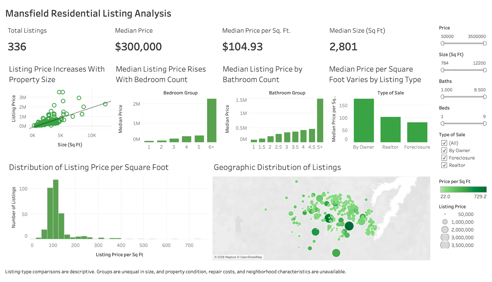

# Mansfield Residential Listing Analysis

An interactive Tableau case study examining how property size, bedroom and
bathroom counts, listing type, and location relate to residential listing
prices in an archived Mansfield, Texas dataset.

> **Source note:** The 336-record dataset was previously obtained from Kaggle.
> The original dataset URL is no longer available. Prices represent listings,
> not confirmed closed sales.

## Executive Summary

The analysis evaluates 336 archived residential listings and replaces
outlier-sensitive averages with medians for the primary dashboard metrics.
Square footage has the strongest observed relationship with listing price among
the available property characteristics. Listing-price and price-per-square-foot
distributions are strongly right-skewed, so rare luxury listings can materially
distort averages.

The dashboard is designed for descriptive price benchmarking. It does not
estimate property value, investment return, or causal price effects.

## Dashboard

[Download the packaged Tableau workbook](dashboard/Mansfield%20Residential%20Listing%20Analysis.twbx)

## Business Questions

1. How does property size relate to listing price?
2. How do median listing prices differ across bedroom and bathroom groups?
3. How does median price per square foot vary by listing type?
4. How are listing prices and price per square foot distributed?
5. Where are the archived properties located?

## Headline Metrics

| Metric | Value |
| --- | ---: |
| Listings | 336 |
| Median listing price | $300,000 |
| Median price per square foot | $104.93 |
| Median property size | 2,801 sq ft |

## Validated Findings

1. **Square footage has the strongest observed relationship with listing
   price.** Its Pearson correlation with price is 0.656, compared with 0.500
   for bedrooms and 0.438 for bathrooms.
2. **The market snapshot is right-skewed.** Mean listing price is $399,140,
   while the median is $300,000. Mean price per square foot is $125.27, while
   the median is $104.93.
3. **Luxury categories have small samples.** The 6+ bedroom group contains
   seven listings. The 5+ bathroom group contains four listings, so their
   medians should not be generalized to the broader dataset.
4. **Listing-type samples are unequal.** The dataset contains 302 Realtor, 24
   By Owner, and 10 Foreclosure listings.
5. **Foreclosure listings have a lower median price per square foot in this
   sample.** The foreclosure median is $81.16 versus $104.05 for Realtor
   listings, approximately 22% lower. Property condition, repair costs, and
   neighborhood characteristics are unavailable.

## Recommendations

- Use median price and median price per square foot when benchmarking listings
  because the distributions contain large luxury outliers.
- Treat 6+ bedroom and 5+ bathroom properties as small specialty segments
  rather than representative categories.
- Use listing type as a screening characteristic, not as evidence of investment
  value.
- Add property condition, year built, lot size, neighborhood, listing date, and
  closed-sale price before attempting valuation or return analysis.

## Tools and Skills Demonstrated

- Tableau dashboard development
- Calculated fields, filters, dashboard actions, and geographic visualization
- Exploratory data analysis and outlier-aware KPI selection
- Business-question definition and analytical guardrails
- Data validation and stakeholder-focused storytelling

## Repository Guide

| Path | Contents |
| --- | --- |
| [`dashboard/`](dashboard/) | Packaged Tableau workbook and dashboard preview |
| [`data/`](data/) | Archived Excel source and data dictionary |
| [`docs/business-requirements.md`](docs/business-requirements.md) | Stakeholders, requirements, and acceptance criteria |
| [`docs/validated-analysis.md`](docs/validated-analysis.md) | Reconciled metrics, sample sizes, and claim corrections |

## Limitations

- The original Kaggle URL and collection date are unavailable.
- The data represents listings rather than confirmed sales.
- Listing-type groups are highly unequal.
- Property condition, repair costs, neighborhood labels, lot size, year built,
  and time-on-market are unavailable.
- The analysis is descriptive and does not establish causality or investment
  return.

## Author

Kiran Williams

[LinkedIn](https://www.linkedin.com/in/kiranwilliams/) |
[Portfolio](https://github.com/keyswill)
